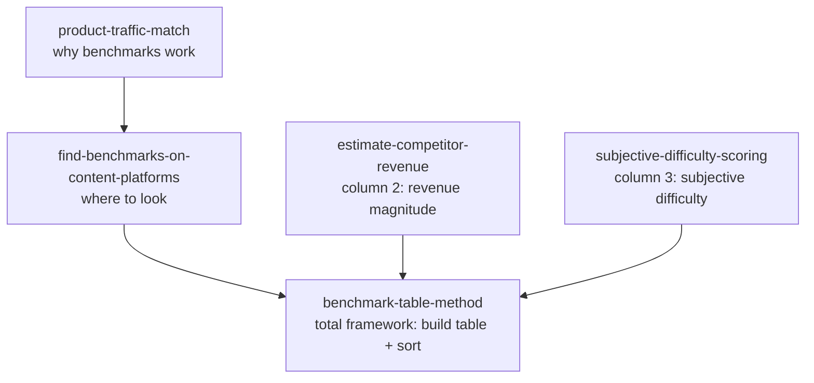

# Benchmark Table Method — 5 Skills for Finding Your First Business

> Turn "finding a business" from gut-feel guessing into an executable survey + sort.
> Distilled from [dontbesilent](https://www.douyin.com/)《3 分钟教会你从 0 到 1 找到属于自己的生意》, via the [ima-distill-pipeline](./SOURCE.md) (cangjie-skill) workflow.

[中文文档](./README.zh-CN.md)

---

## What this is

A single Excel spreadsheet — **3 columns, then sort** — to lock in a copyable, already-validated business within 24 hours.

The method comes from **benchmarking** (施乐 Xerox, 1970s): pixel-decompose peers, reverse-engineer their business, copy what works.

This repo packages the distilled method into **5 atomic, agent-callable skills** that map one-to-one onto the three columns + the underlying first principle + the total framework.

## The 5 Skills

| Skill | Purpose | Maps to |
|---|---|---|
| [`benchmark-table-method`](./benchmark-table-method/) | Build the 3-column table + sort (total framework) | Total framework |
| [`find-benchmarks-on-content-platforms`](./find-benchmarks-on-content-platforms/) | Only find benchmarks where you can see the traffic playbook | Column 1 |
| [`estimate-competitor-revenue`](./estimate-competitor-revenue/) | Estimate revenue to **order of magnitude** by business type | Column 2 |
| [`subjective-difficulty-scoring`](./subjective-difficulty-scoring/) | The 1-5 star "how hard is this for ME to copy" score | Column 3 |
| [`product-traffic-match`](./product-traffic-match/) | First principle: product = goods + matching traffic | Why benchmarks work |



## Quick start

1. **Skim the source digest** ([`SOURCE.md`](./SOURCE.md)) — 5 minutes, you'll have the method.
2. **Install the 5 skills** into your agent's skill directory (WorkBuddy / Claude Code / Cursor):

   ```bash
   # WorkBuddy (user-level)
   cp -r benchmark-table-method find-benchmarks-on-content-platforms \
         estimate-competitor-revenue subjective-difficulty-scoring \
         product-traffic-match ~/.workbuddy/skills/

   # Claude Code / Cursor (project-level)
   cp -r benchmark-table-method find-benchmarks-on-content-platforms \
         estimate-competitor-revenue subjective-difficulty-scoring \
         product-traffic-match .claude/skills/
   ```
3. **Use them**: ask your agent "I want a side project but don't know what to do" — it should call `benchmark-table-method` first.

## The method in 30 seconds

Build an Excel table:

| 对标 (Benchmark) | 收入量级 (Revenue magnitude) | 主观模仿难度 (Subjective difficulty, 1-5★) |
|---|---|---|
| Douyin account A | ~100K RMB/month | ★★ |
| Xiaohongshu blogger B | ~10K RMB/month | ★ |
| Video Accounts creator C | ~1M RMB/month | ★★★★ |
| ... | ... | ... |

Sort by **revenue ↓** and **difficulty ↑**. Top of the list = your answer.

Hard rules:

1. Only fill **Column 1** with businesses whose traffic playbook is transparent to you — i.e. on **content platforms** (Douyin / Xiaohongshu / Video Accounts), **not** on shelf-e-commerce (Taobao / JD / Pinduoduo).
2. Column 2 only needs an **order of magnitude**, not a precise number.
3. Column 3 is your subjective score — anyone recommending projects to you is doing it wrong, because "a good project = subjectively easy for me + objectively hard for others".

See each skill's `SKILL.md` for the full R / I / A1 / A2 / E / B structure.

## Test prompts

Each skill ships with `test-prompts.json` (darwin-skill compatible) covering:

- **Should call** scenarios (2 prompts)
- **Cross-skill bait** — should route to a sibling skill (1 prompt)
- **Out-of-scope** — should not be triggered (1 prompt)

Lightweight phase-4 pressure test per the distillation convention.

## Source & attribution

- Original video: [dontbesilent 聊赚钱 — 3 分钟教会你从 0 到 1 找到属于自己的生意](https://v.douyin.com/P7jVmDtgK8Q/) (Douyin, 7'33")
- Transcribed via SiliconFlow `SenseVoiceSmall`, 2026-08-06
- Distilled via the `cangjie-skill` 7-stage pipeline, phase-4 lightweight
- Cross-deposited to the author's personal ima knowledge base (01 资料库 = original transcript, 03 输出库 = digested single-note)

## License

MIT — see [`LICENSE`](./LICENSE).

The skills themselves are derivations of the public methodology taught in the source video; commercial reuse with attribution is welcome.

## Contributing

Each skill's `SKILL.md` follows the **R / I / A1 / A2 / E / B** structure:

- **R** — Reading: verbatim excerpt ≤150 chars/段
- **I** — Interpretation: the methodology skeleton in your own words
- **A1** — Past Application: author's own use case
- **A2** — Future Trigger: when to invoke this skill (the `description` field)
- **E** — Execution: 1-2-3 actionable steps
- **B** — Boundary: counter-examples and out-of-scope

If you fork one skill, keep all six sections. If you add a skill, link it from this README's mermaid diagram.