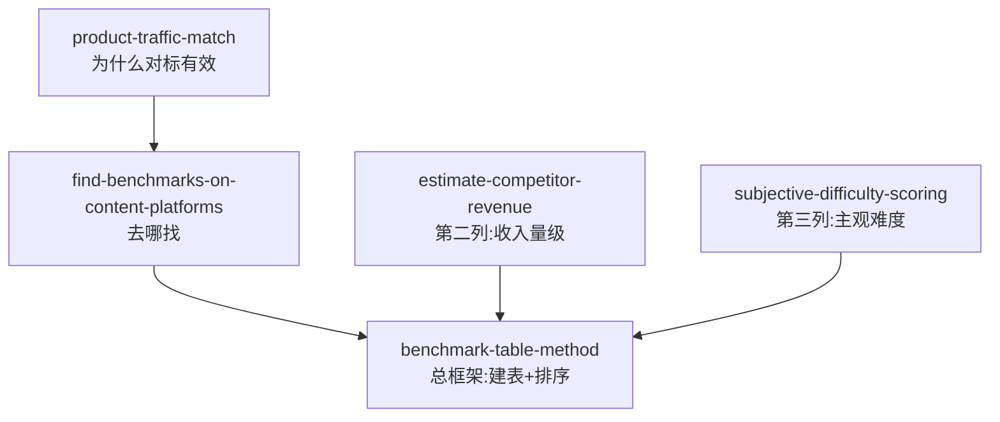

# 表格工作法找生意 — 5 个 Skill，24 小时锁定属于你的第一门生意

> 把"找生意"从玄学变成可执行的调查与排序动作。
> 蒸馏自 [dontbesilent 聊赚钱](https://www.douyin.com/)《3 分钟教会你从 0 到 1 找到属于自己的生意》，方法根是 [ima-distill-pipeline](./SOURCE.md)（cangjie-skill）工作流。

[English version](./README.md)

---

## 这是什么

一张只有 **3 列** 的 Excel 表格，加上排序，**24 小时**内锁定一个可模仿、已被市场验证的生意。

方法根是 **benchmarking**（施乐 Xerox 上世纪七八十年代的方法）：像素级拆解同行，把"别人怎么赚钱"变成可调查、可比较、可排序的数据。

本仓库把蒸馏后的方法封装成 **5 个原子化、可被 agent 直接调用** 的 skill，刚好对应表格的 3 列 + 1 个总框架 + 1 个第一性原理。

## 5 个 Skill

| Skill | 用途 | 对应位置 |
|---|---|---|
| [`benchmark-table-method`](./benchmark-table-method/) | 建 3 列表格 + 排序（总框架） | 总框架 |
| [`find-benchmarks-on-content-platforms`](./find-benchmarks-on-content-platforms/) | 只找"流量打法透明"的对标 | 第一列 |
| [`estimate-competitor-revenue`](./estimate-competitor-revenue/) | 三种业态分别估算收入**量级** | 第二列 |
| [`subjective-difficulty-scoring`](./subjective-difficulty-scoring/) | 给"我 1:1 模仿起来感觉多难"打 1-5 星 | 第三列 |
| [`product-traffic-match`](./product-traffic-match/) | 第一性原理：商品 = 货 + 匹配流量 | 为什么找对标有效 |



## 快速上手

1. **看精华摘要**（[`SOURCE.md`](./SOURCE.md)）— 5 分钟掌握方法。
2. **安装 5 个 skill** 到你 agent 的 skill 目录（WorkBuddy / Claude Code / Cursor）：

   ```bash
   # WorkBuddy（用户级）
   cp -r benchmark-table-method find-benchmarks-on-content-platforms \
         estimate-competitor-revenue subjective-difficulty-scoring \
         product-traffic-match ~/.workbuddy/skills/

   # Claude Code / Cursor（项目级）
   cp -r benchmark-table-method find-benchmarks-on-content-platforms \
         estimate-competitor-revenue subjective-difficulty-scoring \
         product-traffic-match .claude/skills/
   ```
3. **直接用**：跟 agent 说"我想做副业但不知道做什么"，它应该先调用 `benchmark-table-method`。

## 方法 30 秒速览

建一张 Excel 表：

| 对标 | 收入量级 | 主观模仿难度（1-5 星） |
|---|---|---|
| 抖音某账号 A | 约 10 万/月 | ★★ |
| 小红书某博主 B | 约 1 万/月 | ★ |
| 视频号某账号 C | 约 100 万/月 | ★★★★ |
| ... | ... | ... |

**收入降序 + 难度升序**排序，排最前面的就是答案。

**三条硬规则**：

1. **第一列**只收"流量打法对你透明"的生意——也就是**内容平台**（抖音/小红书/视频号）的生意，不收货架电商（淘宝/京东/拼多多）的生意。
2. **第二列**只填**量级**（1 万/10 万/百万），不填准数。
3. **第三列**是你主观打分的——任何人给你推荐"好项目"都是错的，因为"好项目 = 对你主观简单 + 对别人客观难"。

每个 skill 的 `SKILL.md` 里都有完整的 R / I / A1 / A2 / E / B 六段结构。

## 压测用例

每个 skill 都附带 `test-prompts.json`（darwin-skill 兼容），覆盖：

- **应调用**场景（2 条）
- **跨 skill 诱饵**——应路由到兄弟 skill（1 条）
- **射程外**——不应触发（1 条）

按蒸馏约定的轻量化阶段 4 压测。

## 源与致谢

- 原视频：[dontbesilent 聊赚钱 — 3 分钟教会你从 0 到 1 找到属于自己的生意](https://v.douyin.com/P7jVmDtgK8Q/)（抖音，7'33"）
- 转录后端：SiliconFlow `SenseVoiceSmall`，2026-08-06
- 蒸馏流水线：`cangjie-skill` 7 阶段，阶段 4 轻量化
- 同步沉淀到作者的 ima 个人知识库（01 资料库 = 原转录全文，03 输出库 = 蒸馏单笔记）

## 协议

MIT — 见 [`LICENSE`](./LICENSE)。

这些 skill 是原视频公开方法论的衍生品，欢迎在注明出处的前提下商用复用。

## 贡献

每个 skill 的 `SKILL.md` 遵循 **R / I / A1 / A2 / E / B** 六段结构：

- **R** — 原文引用：≤150 字/段
- **I** — 方法骨架：用自己的话重写
- **A1** — 作者亲用案例：作者本人用过的事
- **A2** — 未来触发场景：什么时候该调这个 skill（即 `description` 字段）
- **E** — 执行步骤：1-2-3 可执行动作
- **B** — 边界 / 反例：什么情况下不要用

fork 单个 skill 时请保留全部六段；新增 skill 时请把它接到本 README 的 mermaid 图里。